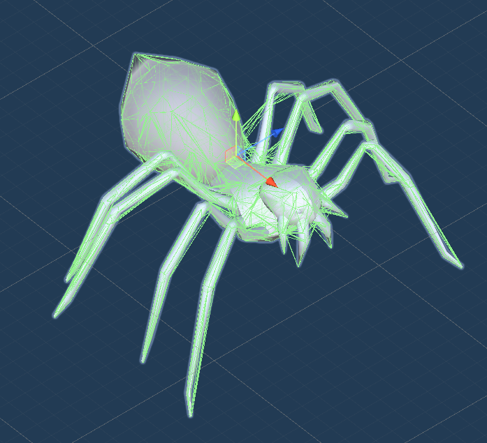
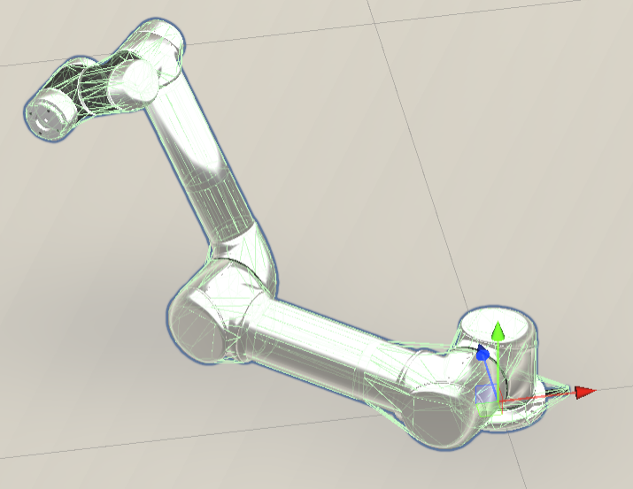

# Asset Bundle Creator

Asset Bundle Creator combines several open-source tools to make it easy to convert source files such as .fbx files into Unity prefabs and asset bundles.

All import processes can be interrupted. This can allow you to combine automatic and manual asset creation methods. You can, for example, automatically generate a prefab from a .fbx file, manually edit to the prefab, and then automatically generate asset bundles.

All 3D objects, articulated or otherwise, receive [hull mesh colliders](doc/hull_mesh_colliders.md), a group of convex mesh colliders generated with [VHACD](https://github.com/kmammou/v-hacd). This means that mesh colliders will always be form-fitting.



You can import .urdf robot files with [RobotCreator](doc/api/robot_creator.md), which is very similar to [Unity's own URDF importer;](https://github.com/Unity-Technologies/URDF-Importer) it's a little more limited in functionality but it also tends to work better. 



You can also import [PartNet Mobility](https://sapien.ucsd.edu/browse) .urdf files; to my knowledge, Asset Bundle Creator is the only such importer for Unity. It is also possible to convert models or .urdf files referenced by [.sdf](https://sdformat.org) and [.lisdf](https://learning-and-intelligent-systems.github.io/kitchen-worlds/tut-lisdf/) files into asset bundles.

There are two caveats:

1. This software uses command-line calls and doesn't have a user interface. A user interface will (hopefully) be added soon.
2. Please review the [license](LICENSE.md).

## Requirements

- Windows, OS X, or Linux
- Unity 2020.3.48, ideally installed via Unity Hub. 
  - When installing, add build options for Windows, OS X, and Linux.
- *Linux only:*
  - To install on a Linux server, [read this.](doc/linux_server.md)
  - libgconf-2-4 (`sudo apt install libgconf-2-4`)
  - From the ubuntu-toolchain ppa (`sudo add-apt-repository ppa:ubuntu-toolchain-r/test`):
    - gcc-9 (`sudo apt install gcc-9`)
    - libstdc++6 (`sudo apt install libstdc++6`)
- *OS X only:*
  - assimp (`brew install assimp`)
- *Windows only*:
  - Visual C++ 2012 Redistributable


## Usage

1. Close Unity Editor 
2. Open a terminal shell
3. Type in the command and press enter

This is an example command-line call:

```powershell
&"C:/Program Files/Unity/Hub/Editor/2020.3.24f1/Editor/Unity.exe" -projectpath "C:/Users/USER/asset_bundle_creator" -quit -batchmode -executeMethod ModelCreator.SourceFileToPrefab -name="model" -source="D:/models/model.obj" -output_directory="D:/asset_bundles/model"
```

**All command-line calls include these arguments:**

| Argument                          | Example                                                      | Description                                                  |
| --------------------------------- | ------------------------------------------------------------ | ------------------------------------------------------------ |
| The path to the Unity executable. | `&"C:/Program Files/Unity/Hub/Editor/2020.3.24f1/Editor/Unity.exe"` | This example is for Windows Powershell. For OS X or Linux, replace `&` with `./` |
| `-projectPath`                    | `"C:/Users/USER/asset_bundle_creator"`                       | The path to the `asset_bundle_creator` Unity Project. Replace `USER` with your user name. |
| `-quit`                           |                                                              | This tells Unity Editor to quit after the call.              |
| `-batchmode`                      |                                                              | This tells Unity Editor to run in the background.            |
| `-executeMethod`                  | `ModelCreator.SourceFileToPrefab`                            | The name of the creator launcher and the method you want to invoke. *Note that there are no double quotes around this value.* |

All other arguments in this call such as `-name="model"` are specific to the method (in this case, `ModelCreator.SourceFileToPrefab`).

This example calls `Cleanup` which will remove all intermediary source file and prefabs from the Unity Project:

```powershell
&"C:/Program Files/Unity/Hub/Editor/2020.3.24f1/Editor/Unity.exe" -projectpath "C:/Users/USER/asset_bundle_creator" -quit -batchmode -executeMethod ModelCreator.Cleanup -cleanup
```

## API Documentation

| Type of creator                                           | Source file types                                            | Description                                                  |
| --------------------------------------------------------- | ------------------------------------------------------------ | ------------------------------------------------------------ |
| [ModelCreator](doc/model_creator.md)                      | .fbx or .obj                                                 | Generates *non-articulated* Unity GameObjects; these GameObjects will have exactly one Rigidbody (at the root object). There may be many visual meshes and mesh colliders. |
| [RobotCreator](doc/robot_creator.md)                      | [.urdf](http://wiki.ros.org/urdf)                            | Generates *articulated* Unity robots. Each joint has an ArticulationBody component (*not* a Rigidbody), visual meshes, and mesh colliders. |
| [CompositeObjectCreator](doc/composite_object_creator.md) | [.urdf](http://wiki.ros.org/urdf)                            | Generates *articulated* Unity GameObjects. Each joint has an Rigidbody component, a Joint component (e.g. a HingeJoint),  visual meshes, and mesh colliders. |
| [AnimationCreator](doc/animation_creator.md)              | .anim or .fbx                                                | Generates asset bundles of .anim files.                      |
| [HumanoidCreator](doc/humanoid_creator.md)                | .fbx                                                         | Generates asset bundles of .fbx files.                       |
| [LisdfReader](doc/lisdf_reader.md)                        | [.sdf](http://sdformat.org/spec?ver=1.9&elem=sdf) or [.lisdf](https://learning-and-intelligent-systems.github.io/kitchen-worlds/tut-lisdf/) | Generates multiple GameObject asset bundles using a combination of RobotCreator and CompositeObjectCreator. |

## Usage with ThreeDWorld (TDW)

This software was originally made for [TDW](https://github.com/threedworld-mit/tdw) and offers some TDW-specific functionality, notably record metadata. TDW includes helpful Python wrapper classes for every command-line call in Asset Bundle Creator:

| Asset Bundle Creator Class                                | TDW Python class                                             |
| --------------------------------------------------------- | ------------------------------------------------------------ |
| [ModelCreator](doc/model_creator.md)                      | [ModelCreator](https://github.com/threedworld-mit/tdw/blob/master/Documentation/lessons/custom_models/custom_models.md) |
| [RobotCreator](doc/robot_creator.md)                      | [RobotCreator](https://github.com/threedworld-mit/tdw/blob/master/Documentation/lessons/robots/custom_robots.md) |
| [CompositeObjectCreator](doc/composite_object_creator.md) | [CompositeObjectCreator](https://github.com/threedworld-mit/tdw/blob/master/Documentation/lessons/composite_objects/create_from_urdf.md) |
| [HumanoidCreator](doc/humanoid_creator.md)                | [HumanoidCreator](https://github.com/threedworld-mit/tdw/blob/master/Documentation/lessons/non_physics_humanoids/custom_humanoids.md) |
| [AnimationCreator](doc/animation_creator.md)              | [HumanoidAnimationCreator](https://github.com/threedworld-mit/tdw/blob/master/Documentation/lessons/non_physics_humanoids/custom_animations.md) |
| [LisdfReader](doc/lisdf_reader.md)                        | [LisdfReader](https://github.com/threedworld-mit/tdw/blob/master/Documentation/lessons/read_write/lisdf.md) |

## Misc. Documentation

- [Changelog](doc/changelog.md)
- [Hull Mesh Colliders](doc/hull_mesh_colliders.md)
- [RobotCreator vs. CompositeObjectCreator](doc/robot_creator_vs_composite_object_creator.md)
- [How to install Unity Editor on a Linux server](doc/linux_server.md)
- [Troubleshooting](doc/troubleshooting.md)

## Roadmap

- Add a Unity Editor user interface
- Add a MaterialCreator
- Add support for ROS
- Update Unity to the latest 2020.3 release